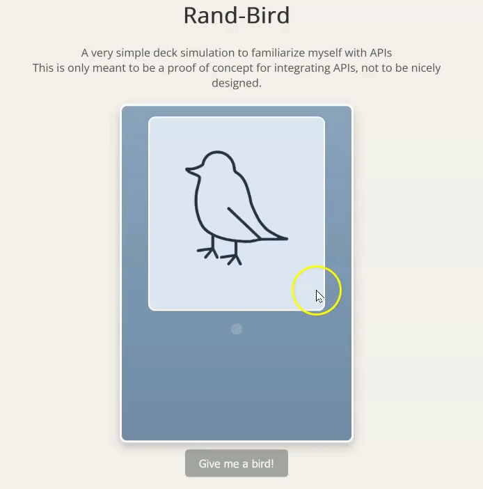

# Rand-Bird

This is a dead simple proof of concept to familiarize myself with APIs. The webpage makes a deck of 52 random birds from [Nuthatch API](https://nuthatch.lastelm.software/) and makes a deck. The user can draw cards from the deck and enjoy random birds / images.

## API Key
If you decide to play around with this on your own system, you'll need an API key. You can get it [here](https://nuthatch.lastelm.software/getKey.html)
